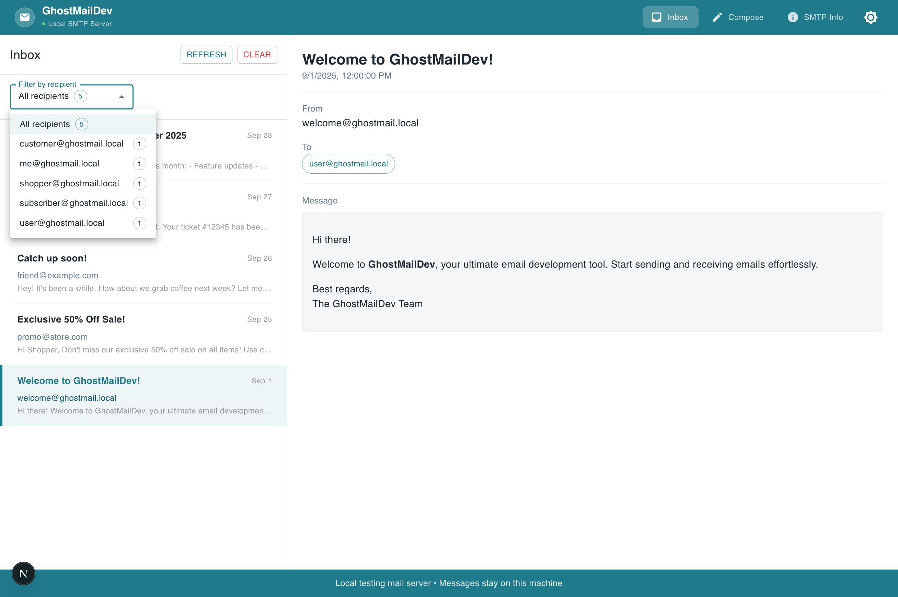
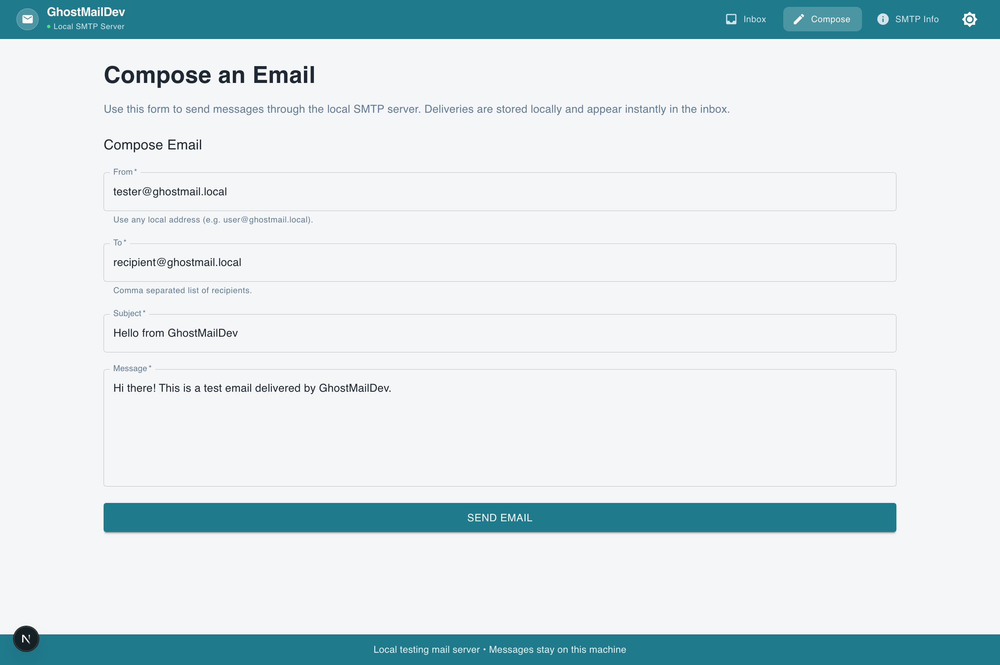
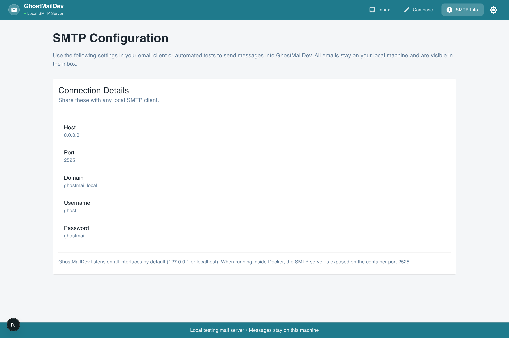

# GhostMailDev
GhostMailDev is a lightweight, local-only mail server and web client intended solely for application development and testing. It provides a disk-backed SMTP listener, a Next.js web UI for composing and inspecting messages, and an optional zero-dependency Docker image for easy local deployment. Not for production use.

## Disclaimer
This tool is vibecoded, it is meant to be used for testing during development, not for use in production. It might have security issues.

## Features

- **Self-contained local mail stack** – SMTP server (port `2525`) and React web UI (port `3002`) run inside a single Node.js process.
- **Inbox viewer** – View all delivered messages, inspect recipients, and render HTML or plain-text bodies.
- **Composer** – Send new messages through the local SMTP relay without leaving the browser.
- **Config dashboard** – Copy host, port, and credential details for use with other tools.
- **Disk-backed storage** – Emails are persisted to `data/emails.json` so they survive restarts when the volume is mounted.

## Screenshots

| Inbox View | Compose Email |
|------------|---------------|
|  |  |

| Info | |
|----------------|--|
|  | |

## Tech stack

- [Next.js 15](https://nextjs.org/) (App Router) with React 19 and Material UI 7.
- [`smtp-server`](https://github.com/nodemailer/smtp-server) for the inbound SMTP listener.
- [`mailparser`](https://github.com/nodemailer/mailparser) for parsing MIME payloads.
- [`nodemailer`](https://nodemailer.com/) for loopback delivery from the web composer.

## Getting started

### Prerequisites

- Node.js 18+
- npm 9+
- Docker (optional, for containerized usage)

### Install dependencies

```bash
npm install
```

### Run in development mode

The development server runs both the SMTP listener and the Next.js dev server with hot reloading.

```bash
npm run dev
```

The web UI is available at <http://localhost:3002>, and the SMTP endpoint listens on port `2525`.

### Build & run for production

```bash
npm run build
npm start
```

### Docker

Build and run the container locally:

```bash
docker build -t ghostmaildev .
docker run --name ghostmaildev \
  -p 3002:3002 \
  -p 2525:2525 \
  -v ghostmail_data:/app/data \
  ghostmaildev
```

Or use the provided Compose file:

```bash
docker compose up --build
```

By default the container exposes:

- Web UI: <http://localhost:3002>
- SMTP server: `localhost:2525`
- Credentials: username `ghost`, password `ghostmail`

### Configure external clients

Point any SMTP-capable client at the running container using:

| Setting   | Value                |
|-----------|----------------------|
| Host      | `localhost` (or container IP) |
| Port      | `2525`               |
| Security  | None / STARTTLS disabled |
| Username  | `ghost`              |
| Password  | `ghostmail`          |
| Sender    | Any `*@ghostmail.local` address |

Messages delivered with these settings will appear instantly inside the web inbox.

## Project structure

```
.
├── app/                 # Next.js App Router pages & API routes
├── components/          # Client components (Inbox, composer, layout)
├── data/                # JSON mail store (persisted locally)
├── lib/                 # Shared config and storage utilities
├── public/              # Static assets
├── server/              # Custom Next.js + SMTP bootstrapper
├── Dockerfile           # Multi-stage production image
├── docker-compose.yml   # Convenience wrapper for local Docker usage
└── README.md            # Setup & usage guide
```

## API endpoints

| Method | Route          | Description                          |
|--------|----------------|--------------------------------------|
| GET    | `/api/emails`  | List all stored emails (newest first) |
| DELETE | `/api/emails`  | Clear the mailbox                     |
| POST   | `/api/send`    | Send a message through SMTP           |

## Environment variables

| Variable            | Default             | Description                              |
|---------------------|---------------------|------------------------------------------|
| `PORT`              | `3002`              | Port for the web UI                      |
| `SMTP_HOST`         | `localhost or 127.0.0.1`           | Address for the SMTP listener            |
| `SMTP_PORT`         | `2525`              | SMTP listener port                        |
| `SMTP_DOMAIN`       | `ghostmail.local`   | Default domain shown in the UI           |
| `SMTP_USERNAME`     | `ghost`             | Username required to authenticate        |
| `SMTP_PASSWORD`     | `ghostmail`         | Password required to authenticate        |
| `EMAIL_STORE_PATH`  | `data/emails.json`  | Relative path to the JSON mail store     |

## Development notes

- The SMTP server writes messages as structured JSON objects. Feel free to script against `app/api/emails` or the underlying `data/emails.json` file for QA workflows.
- The inbox view auto-refreshes every five seconds; use the **Refresh** button to force an immediate update.
- The composer uses the SMTP credentials above. If you change them via environment variables, the UI updates automatically.
- To reset the mailbox, click the **Clear** button in the inbox header or call `DELETE /api/emails`.

## Roadmap

- [ ] Add support for email attachments in the composer and inbox viewer
- [ ] Implement a WYSIWYG editor for composing HTML emails
- [ ] Add a view to inspect the raw email source (headers, MIME parts, and raw payload)
